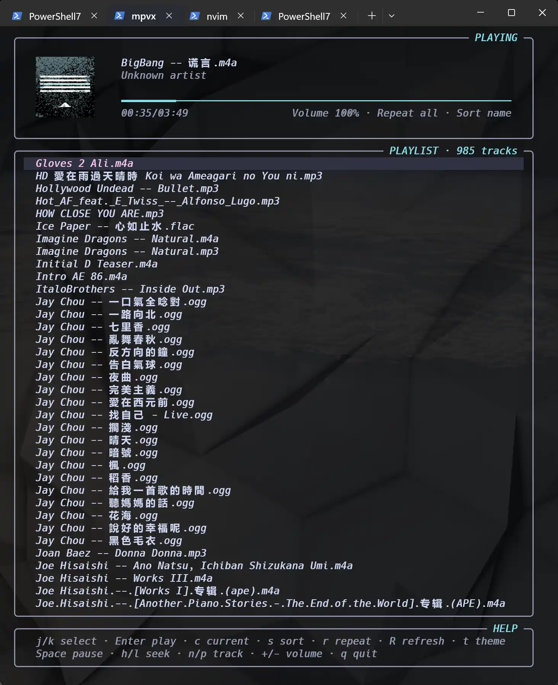

# mpvx



A small terminal music player powered by mpv.

## Usage

```powershell
go run . .
go run . .\music .\podcasts\episode.mp3
go run . --sort name .\music
```

Disable cover images if your terminal does not support SIXEL:

```powershell
mpvx.exe --no-sixel .\music
```

`--sort` accepts `random` (default), `name`, or `path`.

## Keys

| Key | Action |
| --- | --- |
| Up/Down, j/k | Move selection |
| Enter | Play selection |
| Space | Play/pause |
| Left/Right, h/l | Seek 10 seconds |
| n/p | Next/previous track |
| +/- | Change volume |
| PgUp/PgDn | Move one page |
| Home/End, g/G | Select first/last track |
| c | Select the playing track |
| / | Search |
| n/N | Next/previous match |
| s | Cycle sort mode |
| t | Cycle theme |
| r | Toggle playlist/track repeat |
| Esc | Clear errors |
| q, Ctrl+C | Quit |

Themes: Catppuccin Mocha (default), Gruvbox, Nord, and One Dark. 
